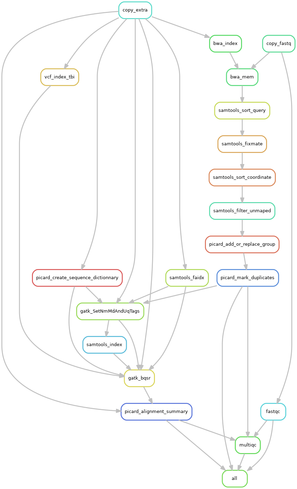

# Snkemake workflow: wes-mapping-bwa-gatk

This is the [Snakemake](https://academic.oup.com/bioinformatics/article/28/19/2520/290322) workflow for WES, fastq formatted reads mapping with [BWA](https://github.com/lh3/bwa), [Samtools](https://github.com/samtools/samtools), and [GATK](https://gatkforums.broadinstitute.org/gatk)

Each tool belong to their respective authors.

## Rule graph:

